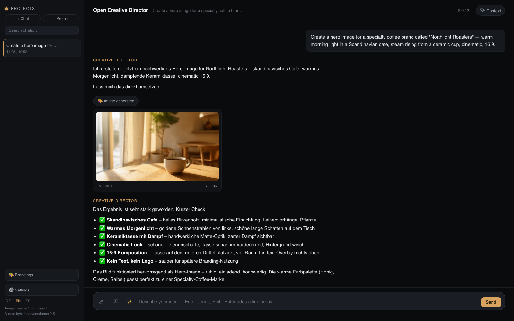
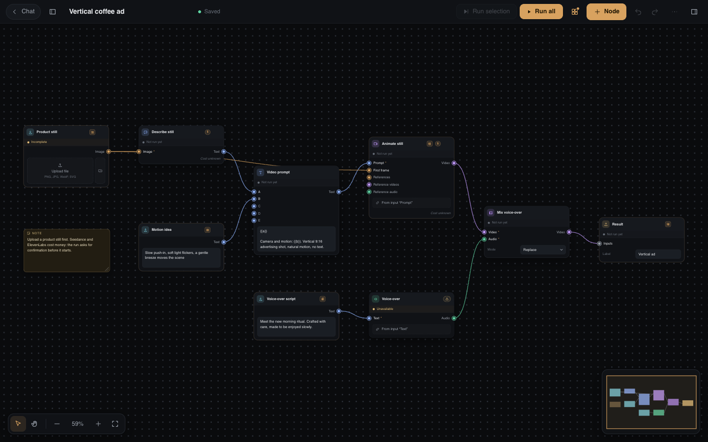

# Open Creative Director

**Your personal AI creative director — a chat app that plans and produces images, videos, voice and motion graphics on your machine.**

Deutsche Version: [README.de.md](README.de.md)

You describe what you want in plain language ("a 15-second vertical ad for my coffee brand, warm morning light"). The Creative Director — an LLM running through [OpenRouter](https://openrouter.ai) — plans the production and executes it with real generation tools: images with **GPT Image 2**, video with **Seedance 2.5**, speech with **ElevenLabs**, 30+ extra models (Kling, Veo, Sora, …) through **Higgsfield**, and HTML/GSAP **motion graphics** rendered on your own machines. Results appear inline in the chat and are stored locally.

Inspired by the Higgsfield "Supercomputer" concept — rebuilt as an open, local-first app.



## Features

- **Chat-driven production** — the Director asks the right questions, then generates. Tool calling, live streaming, cost transparency per generation.
- **Images** — GPT Image 2 generation and editing, reference images, SVG rasterization.
- **Video** — Seedance 2.5 text-to-video and image-to-video (4–30 s). Voice/character consistency via image, video and audio references. Final cuts via `concat_videos`: ffmpeg joins finished clips losslessly, no size limit (needs `ffmpeg` on the PATH).
- **Video model choice** — before a video starts, the Director shows a card in the chat with the OpenRouter video models that fit the job (length, resolution, format, first frame, references): estimated price for exactly this job, strengths and weaknesses, a recommendation. Only the click starts the paid generation; cancelling charges nothing. People with a budget see what is left, options over it are disabled, and the server checks it again and reserves the estimate. “Do not ask again in this chat” remembers the model for you in this chat (in a shared chat everyone else still gets the card; reset above the input field). Admins can switch the question off in Settings → Services (*Ask for the model before every video*); the configured default model then starts right away.
- **Live production status** — running jobs show up in a live status bar with elapsed time, the Director posts results and failures into the chat by itself, and the thinking indicator shows what is currently executing.
- **Speech** — ElevenLabs text-to-speech for voice-overs and voice masters; Eleven v4 by default, the model can be chosen in the node (optional).
- **Higgsfield integration** — connect your higgsfield.ai account with one click (no API key needed) and the Director gains 30+ image/video models, billed as Higgsfield credits on your plan (optional).
- **Motion graphics** — HTML/GSAP compositions rendered to MP4 on one or more render nodes (16:9, 9:16, 1:1) (optional).
- **Node view** — build reusable production flows on a canvas (batch runs, ready-made templates), publish them as a clean Design App and send results back to a chat.
- **Casting** — reusable characters per project: reference images plus a voice master keep faces and voices consistent across episodes.
- **Branding studio** — colors, typography, logos, imagery, tone. Import a design system from a ZIP (e.g. exported from claude.ai/design), export as ZIP.
- **Projects with production profiles** — briefing guidelines, context files, brandings, cast and a per-project memory the Director maintains itself.
- **Roles** — custom system prompts per chat, with an AI role generator.
- **Prompt presets** — a curated, collapsible menu of production-ready prompts (casting, series, branding, motion, social media, marketing) plus your own team-shared presets.
- **Three languages** — UI in English, German and Spanish.
- **Cost journal** — every generation and LLM call is logged with its cost.
- **Agent access (MCP)** — external agents order runs with a personal key, within limits per run and per month ([details](#agent-access-mcp-optional)).

## Quick start

Requirements: [Node.js](https://nodejs.org) ≥ 22, an [OpenRouter](https://openrouter.ai) API key. Optional: `ffmpeg` on your PATH (enables automatic visual consistency checks on finished videos); Poppler (`pdftotext`, `pdftoppm`) for reading PDF files in the node view.

```bash
git clone https://github.com/Kuble-Lab/open-creative-director.git
cd open-creative-director
npm install
cp .env.example .env    # then put your OpenRouter key into .env
npm start               # → http://localhost:3111
```

That's it. Everything else is optional and degrades gracefully.

> Prefer to let an AI agent do the setup? Copy the prompt from [INSTALL-PROMPT.md](INSTALL-PROMPT.md) into Claude Code, Codex or any coding agent.

## Which keys do I need?

| Key / setting | Required? | What it enables | Where to get it |
| --- | --- | --- | --- |
| `OPENROUTER_API_KEY` | **Yes** | The Director LLM, GPT Image 2 images, Seedance 2.5 video — all billed through one OpenRouter account | [openrouter.ai/keys](https://openrouter.ai/keys) |
| `ELEVENLABS_API_KEY` | Optional | Text-to-speech (`generate_speech`, voice list, model list; the models come from your account, a built-in list stands in where the key may not read them) and, in the node view, music and song text (`audio.music`, `audio.music_plan`) and the word times of a song (`audio.lyrics_timing`, for the music video). The ElevenLabs Music API needs a **paid ElevenLabs plan**; without one the music node stops with a clear message and nothing is charged | [elevenlabs.io](https://elevenlabs.io) |
| `FAL_KEY` | Optional | fal.ai models in the node view: the MiniMax H3 Max nodes (text/image/reference video, lip sync, camera moves, extend, insert scene, 3D to video, styles), image to 3D (Tripo, Hunyuan, Meshy, SAM 3D) and a free-form fal.ai model node. Billed per second or per generation by fal.ai | [fal.ai/dashboard/keys](https://fal.ai/dashboard/keys) |
| Higgsfield account | Optional | 30+ extra image/video models for the Director | No key — click **Connect** in Menu → Settings and sign in to Higgsfield in the browser (OAuth login, tokens stay on the server). Behind a reverse proxy set `PUBLIC_BASE_URL` so the browser can reach the callback |
| ChatGPT subscription | Optional | Run the Director on GPT-5.6 models billed to your ChatGPT Plus/Pro plan instead of per-token | No key — log in to the [Codex CLI](https://github.com/openai/codex) with "Sign in with ChatGPT", then click **Import from Codex CLI login** in Menu → Settings. Unofficial route via the Codex backend (gray area in OpenAI's terms) — use at your own discretion. If the subscription cannot be reached (login expired, usage limit, outage) and an OpenRouter key is set, that one model call is repeated through OpenRouter as `openai/<model>`: a notice in the chat says so, it is billed to your OpenRouter account, and the subscription is skipped for 10 minutes |
| `RENDER_NODE_URL` + `RENDER_NODE_TOKEN` | Optional | HTML/GSAP motion-graphics rendering | Run your own render node (see below); multiple nodes manageable in Menu → Settings |
| `PUBLIC_BASE_URL` | Optional | Seedance audio/video references (they require publicly reachable HTTPS URLs); also the base of the Higgsfield login callback (`<PUBLIC_BASE_URL>/api/higgsfield/oauth/callback`) | Only needed when hosting publicly or behind a reverse proxy |
| `AUTH_WHOAMI_URL` + `ADMIN_EMAILS` | Optional | User management behind your own login: private chats/workflows, sharing, admins, team list (`SUPERADMIN_EMAILS`, `AUTH_LOGOUT_URL` optional) | Only for team hosting — locally the app runs open. See [User management](#user-management-optional) |
| `GTS_API_TOKEN` + `GTS_BASE_URL` | Optional | Attach knowledge-base documents as chat context | Any compatible GTS endpoint; the example default points to `gts.kuble.com` |

Keys can also be entered at runtime in **Menu → Settings** (stored server-side in `data/settings.json`, chmod 600, never in the repo) — they override `.env` without a restart.

## How it works

```
Browser (vanilla JS, SSE)
   │
Node/Express server (server.js)
   │
   ├─ Director LLM ── OpenRouter chat completions with tool calling
   ├─ generate_image / edit_image ── GPT Image 2 via OpenRouter
   ├─ generate_video ── Seedance 2.5 via OpenRouter (async jobs + poller)
   ├─ generate_speech / list_voices ── ElevenLabs (optional)
   ├─ higgsfield_* ── Higgsfield MCP client, OAuth login in the browser (optional)
   ├─ render_motion_graphics ── your HyperFrames render node(s) (optional)
   └─ Storage: sessions, assets, brandings, cast, projects — plain files under data/ and assets/
```

No database, no cloud storage: sessions, generated assets, brandings and settings are plain files on your disk. Delete the folder, everything is gone.

## Node view (workflows and Design Apps)



Besides the chat, the **Chat | Nodes** switch in the header opens a canvas for building reusable production flows. Nodes for inputs (text, text list, images, videos, audio), LLM steps, image/video/audio generation, ffmpeg editing and results are wired together; every workflow keeps its media in its own hidden session, so nothing shows up in your chat list. The image and video nodes let you choose the model in the node (see `imageModels` below); “Videos side by side” puts 2 to 4 videos on one canvas to compare them (local, free), “Remove background (fal)” cuts out an image, “Image to 3D (fal)” turns an image into a 3D model (GLB), “Segment video (fal)” cuts a named object out of a video, “Overlay video on video” lays a second video (for example that cutout) over the first, “Burn in captions” writes the sung words into a video as karaoke subtitles, “Sound wave” lays a moving wave over a video and the template “Music video from a song” turns a song into a video cut to the beat.

- **Canvas** — left-drag on the empty canvas draws a selection marquee (Shift adds), the toolbar switches between *Select (V)* and *Hand (H)*; you can also pan with Space + drag, the middle mouse button or two fingers on a trackpad, and zoom with Ctrl/Cmd + wheel or a pinch toward the cursor. Undo/redo, copy/paste, groups and notes work as expected.
- **Runs** — a node, the selection or the whole flow runs on the server. Results are cached by their inputs, so unchanged nodes are skipped. Paid nodes are marked with `$`, the run dialog shows the last known cost, and a paid run always asks for confirmation.
- **Batch** — a *Text list* (one item per line, or blocks separated by `---`) or a *Media list* makes the flow run once per item (up to 50). The counter under the list shows how many items are used.
- **fal.ai (MiniMax H3 Max)** — with a `FAL_KEY` the *fal.ai* category offers nodes for every queue endpoint of MiniMax H3 Max (H3 Max video and Turbo, reference video, lip sync, camera move, extend video, insert scene, 3D to video, five styles) plus a free-form *fal.ai model* node for any other endpoint. Media are uploaded to the fal storage, the job runs in the fal queue and the result is fetched in the background, so you can leave the page. Costs are list-price estimates (fal.ai reports no price); the nodes are experimental until they have been tested live. The realtime *director* endpoint is not offered.
- **Image to 3D (fal.ai)** — the node *Image to 3D* turns an image into a 3D model (GLB) with one of four models of your choice: Tripo H3.1, Hunyuan 3D Pro 3.1, Meshy 7.1 or SAM 3D Objects (experimental; you name the object). The front image is required; up to three more views (left, back, right) improve the back of the model where the model takes them (Tripo needs them in that order without a gap, SAM 3D takes none). The model list shows what each model is good at, how many views it takes and the price from; texture, PBR materials and detail level cost extra with some models and the estimate follows your choices. The result is the GLB file plus a preview image of it (PNG with a transparent background): Tripo, Hunyuan and Meshy deliver their own render; for SAM 3D, or when a render cannot be fetched, the app draws the image itself from the stored model (`lib/glb-preview.js`: in a child process, one model at a time, seen from the front like the card shows it; JPEG and WebP textures need ffmpeg, without it the model is drawn in its colour). The image goes on into other nodes, for example *Edit image*. It is shown in the card, the large view and the Design App with the bundled `<model-viewer>` (drag to rotate, wheel or pinch to zoom, no augmented reality); you download the GLB from the download icon or the result menu. Only GLB is stored, nothing uploads a 3D file, and a 3D model cannot be sent to the chat (its preview image can). A model the app cannot draw (a compressed one, for example) has no preview: a node connected to the *Preview* output then stops with a message and the model stays. The node is open to participants and counts against their budget, like *Remove background (fal)*. When fal.ai finishes a job and bills it but no usable GLB comes out (for example SAM 3D delivers only a splat), the list price goes into the cost journal under the name `betreiber` with the note “Kein Ergebnis (Listenpreis)”: the monitoring shows what the operator paid, a participant's budget is not charged. Prices are list prices of 2026-10-02; **check the terms of each provider (Tripo, Tencent Hunyuan, Meshy, Meta SAM) before you use a generated model commercially.**
- **Segment video (fal.ai)** — the node *Segment video* cuts an object you name out of a video and follows it through the clip (SAM 3, experimental). You write what to cut out in the *Object* field (`person`; several objects with commas, best in English) and choose the *Output*: *Cutout* is a WebM (VP9) with a transparent background, *Mask* a black and white MP4 (the object white; made for editing software), *Object on black* an MP4 without transparency. *Max seconds* (1 to 60, default 10) limits how much of the video is used, *Threshold* (0.1 to 0.9, default 0.5) decides how sure the model has to be: lower finds more, but less precisely. Before anything is sent, the app prepares the video with ffmpeg (`lib/nodes/video-prep.js`): the first *Max seconds*, at most 30 frames per second (a lower rate stays as it is, nothing is invented), at most 1920 pixels on the long side, H.264 in yuv420p, without sound; a video that fits already goes up unchanged. The frames of the file that is really sent are counted exactly (ffprobe), so the price is known before the upload: 0.005 USD per 16 frames, a started block of 16 counts as a whole (about 0.075 USD for 10 s at 24 fps; `PRICES.videoSegment` in `lib/nodes/nodes-fal.js`, list price of 2026-10-03). That count is the amount the run books. The plan shows an upper limit instead: `Max seconds` at 30 frames per second, or the length of the connected video where the plan knows it (a video from a node before that is up to date and has a stored length; an upload has none). Without ffmpeg and ffprobe the node is shown as unavailable, and if it is run anyway it stops with a message before anything is uploaded or charged. The prepared file would show up as an extra asset of the workflow if it went through `fal_generate` like other media, so the node uploads it itself from a scratch folder (`lib/fal.js`, the checks of the tool repeated: a scratch folder of this workflow, file type, size limit, key, cancellation) and deletes it right after; the address goes into `input.video_url`. A video that needed no preparation goes through `fal_generate` like any other media. The result is named by its first bytes (`videoExtensionOf` in `lib/poller.js`: an EBML header is `.webm`, an `ftyp` box is `.mp4`; the endpoint sends `application/octet-stream`) and is never re-encoded, so the transparency of the WebM stays. It has the geometry of the prepared video (at most 1920 pixels, at most 30 frames per second, no sound). Chrome and Firefox show the WebM transparent, Safari does not (the preview then says so); how the ffmpeg nodes treat the transparency is in the next two entries. The node is open to participants and counts against their budget, like *Remove background (fal)*.
- **Transparency through the ffmpeg nodes (WP33b)** — a video has an alpha channel when ffprobe says so: VP8 or VP9 with the stream tag `alpha_mode` = 1, a pixel format with alpha (`yuva*`, `rgba`, `bgra`, `argb`, `abgr`, `ya8`, `ya16*`, `gbrap*`) or ProRes 4444 with alpha (`video.alpha` of `probeMedia` in `lib/nodes/ffmpeg-ops.js`). ffmpeg reads the alpha of VP8 and VP9 only with the decoder `libvpx-vp9` / `libvpx`, so the app names it before `-i` of every input with alpha (`hasDecoder` in `lib/ffmpeg.js`); an ffmpeg without it writes the log line “transparency is lost” and the run goes on. The nodes that reshape exactly one video keep the transparency and write a WebM (VP9 with alpha, `-crf 32`, the sound as Opus): *Trim video* (always re-encoded with alpha), *Change speed*, *Resize video* (the bars of *contain* are transparent), *Adjust video colours* and *Concatenate videos* (when every clip has alpha; clips of another size sit on transparent bars). Everything else writes MP4 as before and the transparency is gone: *Overlay image on video*, *Overlay video on video*, *Merge audio into video*, *Burn in captions*, *Sound wave*, *Videos side by side* and the finished films of the explainer video and the music video; *Extract frame* writes a PNG, which keeps the alpha. An ffmpeg without the encoder `libvpx-vp9` or `libopus` writes MP4 for the nodes of the first list too, with a log line. A video without alpha gets exactly the ffmpeg arguments it got before. A result with alpha is marked in the ledger (`alpha`), and the node view shows a chequerboard behind it (also in the thumbnail and the app view); Safari and every browser on an iPhone or iPad play the WebM without its transparency, so the view adds a short note there. Images and uploads are marked too since WP33c (next entry).
- **Overlay video on video (WP33b)** — the node *Overlay video on video* (`video.overlay_video`, local, free) lays a second video, the *layer*, over a *background* video; the result is an MP4 in the size of the background. A layer with an alpha channel (the *Cutout* of *Segment video*) is laid with its transparency; for a layer on a green background without alpha, set *Remove a colour* to *Chroma key* and choose the colour, the similarity and the soft edge. *X* and *Y* are pixels or percent (default: the centre), *Scale* is a share of the width of the background (default 100), *Opacity* runs from 0 to 1, *Start* is the second of the background at which the layer appears, *End* the second from which it is hidden (0 = until its own end), *Loop the layer* starts it over until the result ends. *Length* is the length of the background (default; a longer layer is cut), of the layer (a shorter background holds its last frame) or the shorter of the two; *Sound* is the sound of the background (default), of the layer (delayed by *Start*), a mix of both or none. The template *Cut out an object and place it over another video* (`video-cutout-overlay`) chains *Segment video* (output *Cutout*) and this node; its description names the price of the segmentation (0.005 USD per 16 frames) and that Safari does not show the transparency of the intermediate result.
- **Chequerboard for images and uploads, edge cases of the overlay, notes (WP33c)** — every file the app stores is looked at once, in one place (`saveAsset`, `completeAsset` and `completeAssetFile` of `lib/store.js`, with `lib/alpha.js`): a PNG or WebP image whose header says it has an alpha channel (PNG colour type 4 or 6 or a `tRNS` chunk; WebP `VP8X` alpha flag or the alpha bit of `VP8L`) is then checked pixel by pixel with ffmpeg (`alphaextract` and `signalstats`, one call: the lowest alpha must be below 255), because many generators write RGBA PNGs in which every pixel is opaque. Without ffmpeg (or without those two filters) the header alone counts; an ffmpeg that fails on the file gives no mark. A WebM, MKV or MOV video goes through ffprobe and `streamHasAlpha`; MP4, JPEG, GIF and audio are not looked at at all, so they cost no time. The ledger entry gets `alpha: true` and the node view shows the chequerboard behind the image or video in the card, the thumbnail, the large view, the app view and the asset lists (upload field and picker); the Safari note stays with videos, because Safari shows images with alpha correctly. What WP33b has already decided (the ffmpeg ops, the WebM of fal, the concatenation) is not looked at again; a failure or a missing ffmpeg gives no mark and storing always goes on; existing assets are not marked (no migration). The chequerboard sits behind the picture itself and not in the empty margins of its frame (an image or video with alpha takes the shape of its picture instead of filling a bigger box with `object-fit: contain`). *Overlay image on video* and *Overlay video on video*: a background with an odd width or height stopped in the libx264 encoder; now one pixel is added at the end of the graph (`pad=ceil(iw/2)*2:ceil(ih/2)*2`), only for such a background; with even sizes the ffmpeg arguments are exactly the old ones. *Overlay video on video* writes a log line when the layer starts at or after the end of the background and the length is *Background* or *Shortest*, because the layer is then never seen. The two templates that take a PDF (*Explainer video from a PDF* and *Explainer video: script from a PDF*) say in their description and note: use only PDFs you have the rights to; figures from the PDF appear in the video.
- **Music and song text (ElevenLabs)** — *Generate music* makes music from a description or from a song text with structure; with a video on its *Length like video* input the music is as long as the video (rounded up, 3 to 600 seconds), otherwise *Length* decides, and a song text sets the length through its sections. *Song text and structure* writes such a song text from an idea. It is plain text you can edit: `+` lines are wanted styles, `-` lines unwanted ones, `[Verse 1 | 20 s]` starts a section (20 s, 20s or 0:20, 3 to 120 seconds, the song 10 minutes at most), every other line is a song line (30 per section, 200 characters each; with the newer models *music_v2* and *music_v2_5* the section name counts as one of the 30 lines, so 29 song lines); `\+`, `\-`, `\[` at the start of a line stand for the character itself. The inspector checks the text while you type and names the line of a problem. To change the text, right-click *Song text and structure* and choose *Use as text*: a Prompt node with the text appears and takes over the connections of that output (one undo step, nothing runs). *Use as text* works for any node with exactly one text result, language-model nodes included. Vocals work in English, Spanish, German and Japanese; ElevenLabs rejects artist names and protected lyrics and the node shows its suggestion. The music is a paid node (the estimate is by the minute, see `ELEVENLABS_MUSIC_USD_PER_MIN` below, and unknown while the length comes through a connection); the song text costs no credits but counts against the limits of your plan and is marked as free. *Text to speech* is a paid node as well, with an estimate by character and model; its *Speech model* is chosen from a list (Eleven v4 for new nodes; a workflow saved with another model keeps it). Participants may use both and pay from the budget of their team. Guests have no team and a budget of 0: they can use the song text, but the music stops with a budget error.
- **Music video from a song** — the template *Music video from a song* turns a song into a video that is cut to the beat. You bring the song, a photo of the main person and an idea for the video (what happens in it; the run does not start without it), and the text of the song if you have it. Four nodes do the song-specific work and can be used on their own. *Analyze song* (`audio.beats`) finds the tempo, the beats, the sections and the loudness on this machine, free of charge. *Lyrics timing (ElevenLabs)* (`audio.lyrics_timing`) finds when each word and line is sung: with the text it is aligned to the audio (forced alignment, a song plan with `[Section | 20 s]` lines works as the text), without it the words are recognised (Scribe). It is a paid node, priced by the hour of audio (`ELEVENLABS_TIMING_USD_PER_HOUR` below, a few cents for a song); the length is measured and decides what is booked, and the plan shows a price only once the length is known (a song from the music node carries its length, an uploaded file does not). A song may be 20 minutes and 150 MB at most. *Plan music video* (`music_video.plan`, a language model of your choice) cuts the song into scenes and writes an image prompt and a motion for each from your idea. The cuts are not left to the model: the app computes them from the beats and the lyric lines (*Cut on*: lines, beats or sections; *Scenes per minute* 6 to 30; *Clip length* 2 to 10 seconds, the longest story scene). A plan has at most 50 scenes, so a song of more than about four minutes needs longer clips. *Share of singer scenes* (0 to 1, default 0.3) decides how many scenes show the singer: windows of 5 to 10 seconds of sung lines, taken preferably from the chorus and the loud parts and spread over the song, each with its exact slice of the song as audio (WAV, to the sample) for the lip sync, which takes 5 seconds at least. With a share of 0, for a song without words and without lyric times there is no such scene: the lists are then empty and everything else runs as usual (without lyric times the cuts follow the beats and the plan node warns). *Cut to the beat* (`music_video.edit`, local and free) puts the clips on the beat and lays the song underneath: every scene gets exactly its frames, a story clip that is too short is slowed down to 0.8 at most and then holds its last frame, the clip of the singer is never slowed down (the lips stay in sync). *Transition* is cut, crossfade or flash; the video is 720p or 1080p at 24, 25 or 30 frames per second, cropped or padded to the format, with a fade-out at the end. A wrong number of clips is named before anything is cut. The cut can burn the lyrics in as captions (*Captions*: off, karaoke, single words or lines; *Caption position*): connect the lyric times of *Lyrics timing* to its optional input *Caption times*. The captions are drawn in the one encoder pass that makes the film, so a film cut in batches gets them once; the times of the song are converted to the times of the film, and a song without words stays without text. They need libass (see *Captions and sound wave* below). The template wires it all: an image for every scene (the photo is the reference), a video from every story image (*H3 Max video* on fal.ai with the model *turbo*, 768P, 5 seconds, 0.04 US dollars a second, so 0.20 per clip), a lip-synced clip (*H3 Max lip sync*, fal.ai) for every scene of the singer, and the cut. Both clip nodes need `FAL_KEY`. The story clips are not made with the video model of the settings because the template puts the person of your photo into every story scene and Seedance refuses images that may show a real person; in the node you can switch to the model *max* or to 1080P for more quality, and for scenes without people *Generate video* works as well. The format is 16:9; for another one change it in the plan and in both image nodes (the clips follow their first image), and keep the clip length of the plan equal to the duration of the story clips (H3 Max makes 5 seconds at least). A song of two minutes costs about 11 US dollars with the preset settings (24 story clips at 0.20 = 4.80, 28 images at about 0.13 = 3.75, four singer scenes of about 7 seconds in 768P about 2.40, the plan and the times a few cents) and roughly 5 to 20 depending on the number of scenes, the image model and the video settings; the prices of the images, clips and lip sync are known once the plan has run, so the first confirmation shows them as unknown, and nothing is charged before it. The template switches the captions on (karaoke at the bottom, from the lyric times of the same song); the switch *Captions* in its form turns them off, which is also the way out on a server whose ffmpeg has no libass. The cheaper variant is the template *Music video from a song (moving images)*: the story scenes are not made into video clips by fal.ai but moved by the local *Still image zoom* (a slow movement that changes from scene to scene, 5 seconds, made on this machine, free), so only the images and the lip sync of the singer scenes are charged. A song of two minutes then costs about 6 US dollars with the preset settings (28 images at about 0.13 = 3.75, four singer scenes of about 7 seconds about 2.40, the plan and the times a few cents) and roughly 3 to 10, against about 11 with video clips; the rest is the same, and so are the inputs. The story scenes move in turn (zoom in, pan right, zoom out, pan left, by their position), and a switch in the form adds a depth map per image for a parallax effect (off by default, a few cents); for real movement inside the picture use the template with video clips. In the chat the Director offers the template for requests like “music video” or “video for my song” (the variant with the words “moving images” or “cheap”), asks for the song, the photo and the idea, and starts only after your click.
- **Explainer video: documents, research, branding, planner (WP37a)** — the foundation for explainer videos; it ends at the script (the voice, the scenes and the cut follow in WP37b below). *Document input* (`input.document`) takes PDF, TXT and MD files (50 MB each at most; a PDF must start with `%PDF-`, a text file must be UTF-8; the server checks the content, not only the name). *Read documents* (`doc.read`) reads them on this machine, free of charge, with Poppler (`pdftotext`, `pdftoppm`; on macOS `brew install poppler`, on Debian `apt install poppler-utils`; `POPPLER_BIN_DIR` names another folder): the text has a mark before every page (`[p. 3]` without a language, `[Seite 3]`, `[Page 3]` or `[Página 3]` with one), the info text gives pages and characters per page and says when a document looks scanned, optionally the pages come as images (150 dpi), and the PDFs are handed on for a model that reads files. Text and Markdown files have no pages: sections of about 6000 characters act as pages. *Max pages* (default 150, at most 300) is a budget for all documents together. *Research the topic* (`llm.research`, Opus 5.5 by default) searches the web through OpenRouter (plugin `web`, 1 to 20 results, optional lists of allowed and blocked domains) and writes notes in which every fact carries a number [n] and the list of sources has title, address and date. It needs OpenRouter (not a ChatGPT model) and costs the tokens plus about 0.7 cent a search. *Branding* (`input.branding`) hands over a brand from the branding library as a short profile (colours, fonts, tone, rules) and its logo; it is not open to participants and guests. *Plan explainer video* (`explainer.plan`) writes the script from a document, from research notes or from a topic: scenes with narration, text on screen (title of 6 words at most, 3 bullets of 7 words at most, numbers, quotes), elements with the word they appear on, a figure where one helps, and the sources of every statement (page of the document or number of the research). The length of the narration decides the length of the scene (135 words a minute in German, 150 in English and Spanish), a scene is 15 seconds at most, and what the model gets wrong in the numbers is repaired by the app, not left to the model; one repair request goes back to the model when the script is too short, too long or has empty scenes. *Visual mode*: `motion` (everything is drawn by code), `mix` (default: numbers, quotes, figures and flows are always motion, stills for at most *Share of stills* = 0.35 of the scenes, at most 2 clips and only with fal.ai) and `ai_video` (every scene a clip); a mode the account cannot do (no image model, no fal.ai) is lowered, and the script says so. *Check statements* (default on) runs a second pass that compares each statement with the document or the research; it can only shorten or remove. The script counts as verified only when the check answered for every scene (and for as long as nobody edits its text); when it fails, skips scenes or would empty the script, the script stays as planned, is marked not verified and the log says why. The model is *Opus 5.5* (`anthropic/claude-opus-5.5`, 4 and 20 US dollars per million tokens) unless you choose another; if the account may not use it, the person's default model is used and the log says so. A PDF goes to the model both as text with page marks and, where the model reads files, as the file itself (at most 22 MB of PDF in all, because files travel as base64, and 300 pages each; a ChatGPT model gets the text only; without an OpenRouter key the default model of the app is used instead of Opus 5.5). The result is the script as JSON (`script`) and lists by scene: `narration` and `briefs` (what is on screen) have one entry for every scene (the closing sources card has an empty narration), `image_prompts` and `clip_prompts` only the scenes of that kind, `shots` says where each scene sits in them, plus `presenter` and the sources as text. Two phases: put an edited script into the field *Edited script* and run the node again; it is only checked and passed on, with no model call and no cost. The templates *Explainer video: script from a PDF* (needs OpenRouter and Poppler; about 0.50 to 0.90 US dollars for a 20-page PDF and 2 minutes, reading is free) and *Explainer video: script for a topic* (needs OpenRouter; about 0.30 to 0.50 US dollars for 2 minutes with research) wire it all. These are orders of magnitude from the research on explainer videos, not prices: the plan shows no price until the document has been read, and the run asks first.
- **Explainer video: voice, scenes, cut, three workflows (WP37b)** — the film behind the script of the explainer video. *Explainer voice* (`explainer.voice`, ElevenLabs `with-timestamps`, paid by the characters, 0.08 US dollars per 1000 for Eleven v4) speaks the narration of every scene and returns the audio, the word times (built from the times of the characters, in the format of *Word times*) and the length. The narration of the scenes before and after goes along as `previous_text` and `next_text` (switch *Use text around the scene*, on by default); if the API refuses the fields for a model, the call is made once more without them and the log says so. A scene without narration (the sources card, one line for each document with all its pages, e.g. `Report (p. 1, 2, 3)`, and one line for each source of the research) makes no call, costs nothing and gives 4 seconds of silence. *Draw explainer scene* (`explainer.scene`, Opus 5.5 by default, about 0.10 US dollars a scene) turns the brief of a scene, the word times and the brand into a motion-graphics film on the render node: the length is the voice plus 0.4 seconds in whole frames, every element appears at the start of its anchor word minus 0.15 seconds (but not before 0.2 seconds; a title that opens the scene always comes at 0.2 seconds, whatever its word, so that no scene starts empty), the model writes the HTML, the app checks it (structure, forbidden calls, no web address except the files of the GSAP package, no navigation: no `location`, link, form or markup built in code) and puts a content security policy first in its `<head>` (scripts only from the GSAP package, no form, no `<base>`, no requests), renders it and looks at two frames (at half of the scene or at the last cue, and at the end). Only blockers lead to a new try (*Retries*, default 2: the same conversation goes on, the model sees its answer and the problem); a scene that still fails is drawn by the fixed fallback (title, at most three bullets or numbers, in the colours of the brand, with the still as background) unless *Fallback* is off. Stills, figures and logo are matched by the id of the scene (`Scene s3 ...`), never by position: a figure is cut out of the page image with a margin of 2 %, the source line is not written by the model: the app builds it from the source references and the titles of the documents (the pages of one document together: `Report, p. 1, 2`) and puts it small and right-aligned at the very bottom of the frame, in the code of the model's scene and of the fallback alike, while the model keeps the lower 20 % of the frame (16 % in portrait) free of text for the captions that the cut burns in, so the two never cover each other; brand fonts are embedded (two files of 400 KB at most each, the HTML stays under 2 MB). A scene that is planned as a clip gets a plain stand-in that the cut replaces by the clip. The output is silent and as long as the scene to the frame. *Cut explainer video* (`explainer.edit`, local ffmpeg, free) puts the scenes in a row, each voice on the exact frame where its scene starts (cut or crossfade of a quarter second, which makes the film shorter by the overlap), mixes music under it (*Music level* quiet, medium or loud; *Ducking* lowers it under the voice), brings the whole sound to -16 LUFS (one gain from a measurement of the loudness, then a limiter at about -1.5 dBFS so that nothing clips; if the measurement fails, the sound stays as it is and the log says so), optionally puts intro and outro (with their own sound) before and after, uses the clips of the shot list for scenes that are clips (trimmed, slowed down or held) and burns in captions (needs libass in ffmpeg). It also gives the subtitles as an SRT file and the captions as word times of the film. The log names the real length and warns when it differs from the target by more than 15 %. The templates *Explainer video from a PDF* (page images of the PDF are read so that figures can be cut out; about 2.50 to 3.50 US dollars for 20 pages and 2 minutes, music included), *Explainer video for a topic* (research with sources; about 2 to 3 US dollars for 2 minutes) and *Explainer video with a presenter (portrait)* (a photo speaks the intro and the outro with H3 Max lip sync on fal.ai, so it needs fal.ai and the consent of the person; about 4 to 5 US dollars) wire it all (they need OpenRouter, ElevenLabs, a render node and ffmpeg). Each of them has a *Background music* node (ElevenLabs, instrumental, 120 seconds, about 0.40 US dollars, a paid ElevenLabs plan is needed; delete the node if you have none) that feeds the cut, where it repeats if the film is longer. The render node renders one scene at a time: every scene waits for the ones sent before it (a minute more per job on top of 8 minutes), and a voice that is longer than its scene is named in the log of the cut. These are estimates; the plan shows the real price of the voices and the scenes once the script exists, and the run asks first. **Always run only the planner first** (*Plan explainer video*), read the script, edit it in the field *Edited script* and then run everything: the edited script is only checked, with no model call. The planner switch *Allow AI video clips* is off in the three workflows (they have no clip chain). The logo of a branding is not wired in the templates (without a branding there is none and the plan would refuse the run): choose a branding and connect its *Logo* output to *Draw explainer scene* to show it.
- **Captions and sound wave** — *Burn in captions* (`video.captions`, local and free) writes the sung words into a video. It takes the video and the lyric times of *Lyrics timing (ElevenLabs)* (the JSON text with `lines` and `words`). *Style*: *Karaoke* (the line stands and each word changes colour while it is sung), *Single words* or *Lyric lines*; *Position*: bottom, middle or top. *Text size* is a share of the picture height (0 = automatic: 6 %, a little less in portrait); the colour, the highlight colour, the outline, the font (DejaVu, Liberation or Noto) and upper case can be set, and *Offset* shifts all times in seconds. Long lines are wrapped to the picture. A line shows from 0.4 s before its first word to 0.4 s after its last one; times without words or lines leave the video as it is, and a karaoke line whose times have no words gets them spread evenly. The sound is copied. The text is drawn by libass (the filter `ass` of ffmpeg) from an ASS script the app writes itself (`lib/captions-ass.js`, a pure module); an ffmpeg without libass (`ffmpeg -hide_banner -filters` has no `ass`) shows the node as unavailable and the run is refused before anything starts, and the picture needs a font on the system (for example the package `fonts-dejavu-core`). *Sound wave* (`video.soundwave`, local and free) lays a wave over a video that follows the sound: the sound of the video, or of an audio on the optional second input (if the video has no sound of its own, that audio also becomes the sound of the result). *Mode*: waveform (line, outline, filled band, dots) or *bars* (the spectrum); *Position*, *Height* (share of the picture height, as wide as the picture), *Colour* and *Opacity*. The picture is encoded again, the sound is copied where it is AAC or MP3. Both nodes keep the size and the length of the video. Chinese and Japanese are wrapped between characters under the rules of kinsoku (no row starts with a closing mark or ends with an opening bracket) and a wide character counts two columns; Hebrew and Arabic stay in logical order and libass lays them out right to left, but its karaoke fill would run from the wrong side of each word, so the node uses *Single words* there and says so in its log. Where `fc-list :lang=ja|zh|ko|ar|he` finds no font, the log warns and names `fonts-noto-cjk` or `fonts-noto-core` (the captions are made anyway).
- **Still image zoom: movement and parallax** — *Still image zoom (local)* (`image.to_video`) has the motions *Zoom in* and *Zoom out*, *Pan left / right / up / down* (constant zoom 1.15), *Alternate* (in and out by the position of the item in a list) and *Varied* (in, pan right, out, pan left; the template *Music video from a song (moving images)* uses it). The parallax motions (*Parallax left / right / in*) take the optional input *Depth map* (grayscale, bright = near) from *Depth map (fal)* (`fal.depth_map`, Depth Anything V2, about 0.01 US dollars per image as an estimate: the price page shows no figure) and *Parallax strength* (0–100 %, 30): `geq` turns the depth into a displacement map and `displace` moves the picture, all locally. Without a depth map the matching pan or zoom is made and the log says so. The template has a switch for the depth maps (off by default).
- **Cache per item and scene table** — a node that runs once per item of a list keeps a key for every item, so a second run only makes the items whose inputs or settings changed (the log says *Reused 4 of 6 unchanged items*) and the plan prices only those. A node can narrow what an item reads (`itemKeyInputs`): a scene of the explainer video counts its own entry of the shot list (plus the fields that hold for all scenes), its still, the page images of its figure, the brand and the logo, so one changed shot makes one scene run again and not all; the voice leaves out the text around the scene where it does not read it. The run mode `items` (`{ mode: 'items', nodeId, items: [0, 2] }`) makes chosen items of a list result again and keeps the others. The inspector shows this as a *scene table* for a node with a list result: a row per item (number, preview, main text, length), *Make again* per row with the price of one item and a confirmation for paid nodes, and *Make selected again* for ticked rows; it works on desktop and phone. It needs a result that was made item by item (an older one works after its next run); scenes are not swapped or moved.
- **Prompt node** — *Prompt* (first entry of the *Inputs* category) is a dedicated node with a large text field for writing a prompt on the canvas; wire it into one or more generation nodes so the graph shows which prompt goes where. The embedded prompt fields still work: the small button in their corner (and the one next to the field in the inspector) moves the text into a new Prompt node left of the node and connects it (one undo step). Dragging a connection from a node and dropping it on the empty canvas opens a quick pick at that spot with only the nodes that fit (Prompt first for text inputs); Esc or a click beside it cancels.
- **Port help** — hover a port (dot or label, inputs and outputs) for about a third of a second to see what it expects or delivers: name, type, required or optional, a short description, how many connections it takes and in which order they count. Esc, a click, a drag, scrolling or zooming hides it.
- **Several references** — inputs with a double ring (for example *Images* of the H3 Max reference node, *References* of Seedance) take several connections, shown as `n/max` next to the label. Either wire several image nodes to the same input, or wire one *Media list* to it: a list on such an input delivers all its files at once, while a list on a single input runs the node once per item. Draw further connections from the output of each source to the same input (dragging from the input itself detaches its last connection). In prompts, the references count in the order of the connections (H3 Max reference video: "Image 1", "Image 2", "Video 1" …); a media list counts with all of its files and each file counts toward the maximum, so the numbers after a list shift and the hover help then no longer shows positions. Every connection shows its number on its own curve, and under an input with two or more connections the card shows a numbered row of the sources (previews for images) in exactly this order: drag an entry, use the arrow keys or right-click it to change the order, so that "Image 1" in the prompt means the picture you expect; the node then runs again. Dragging from a multi-input onto the empty canvas offers the *Media list* and the matching single input node first.
- **Motion graphics from HTML** — the *Motion graphics from HTML (render node)* node renders finished HTML/GSAP code, not an instruction. Code comes from a *Motion HTML writer* node in front of it (describe the animation there; attach the same files to both nodes and refer to them as `{{asset:1}}`, `{{asset:2}}` …) or is pasted into the field. To join videos use *Concatenate videos* instead. If the field holds plain text ("make it one video") or HTML without the `data-width` / `data-height` of the chosen format, the node is marked incomplete before the run and says what to change; for plain text the button *Convert to HTML with AI* adds a Prompt node and a Motion HTML writer to the left (your text becomes the prompt, the format and the files are copied, the field is cleared, one undo step). Nothing runs until you start it; the writer is a paid node and asks for confirmation as usual.
- **Assets** — every image/video/audio input takes an upload, a file from one of your chats, or an asset already produced in this workflow.
- **Export and import** — the workflow menu offers *Export (JSON)* (graph and app only) and *Export with files (ZIP)*, which adds the input images, videos and audio of the nodes (generated results stay out; the results ZIP covers those). Before the ZIP download the size is shown; above 500 MB or 200 files a hint says that an import with the default limits fails (the export itself still works). *Import* takes `.json` and `.zip`, recognised by extension and content. A ZIP shows an upload card with progress and is checked completely before anything is created (500 MB, 200 files, only images, video and audio, no unsafe paths); on any error nothing is left behind. After every import a note says how many files came along, for example “3 of 4 files imported, 1 missing”. A JSON import on the same server takes back the files you are allowed to see (your own or shared workflows); everything else stays marked missing and is uploaded again in the node.
- **Templates** — *New from template* offers ready flows, for example: Product hero (4 variants), Still to vertical ad with voice-over, Consistent character series (batch), Continuous shots via last frame, Motion title over footage, Masked edit, Clip in three national languages (Higgsfield dubbing with lip sync), Talking portrait (ElevenLabs voice plus H3 Max lip sync on fal.ai), Photo to 3D model (background removal, then Tripo on fal.ai), Video with music (music as long as the video, mixed quietly under the original sound), Song from an idea (song text, then music) and Music video from a song (beats and word times, a plan of scenes, an image and a clip per scene, lip sync for the singer, cut to the beat), Explainer video from a PDF, Explainer video for a topic and Explainer video with a presenter (voice, scenes drawn as motion graphics, cut with captions; about 2.50 to 3.50, 2 to 3 and 4 to 5 US dollars for 2 minutes, music included), Explainer video: script from a PDF (about 0.50 to 0.90 US dollars for 20 pages) and Explainer video: script for a topic (about 0.30 to 0.50 US dollars), the two script templates give the script with sources only. Templates whose provider is not configured are shown as unavailable; their texts come in English, German and Spanish.
- **Design App** — switch on *Design App* in the top bar, expose parameters of your nodes (the small toggle next to a field) and pick the result nodes. `#app=<workflow id>` then shows a clean form with a *Run* button, live status, a result gallery, downloads and *Send to chat*. The form values only apply to that run; the saved workflow is not changed.
- **Chat bridge** — *Send to chat* first shows what will be sent (media with a small preview, texts with their first characters; extra texts of a media result start unchecked), then copies the result into a chat of your choice. There it appears as a card with the workflow, the node, a player or thumbnail, collapsible texts and a link back to the workflow. The Director sees the files with their asset IDs and can continue from there; nothing starts automatically.
- **Projects** — assign a workflow to a project (the same folders your chats use); the project name shows in the workflow list. Who can see a workflow depends on the [user management](#user-management-optional) (open for everybody when it is off); deleting one also deletes its media (the app asks for confirmation first).

## Motion-graphics render node (optional)

The `render_motion_graphics` tool sends HTML/GSAP compositions to a small render service (Node + [hyperframes](https://www.npmjs.com/package/hyperframes) + Chrome + ffmpeg) that can run on the same machine or any other computer — reachable directly or through an SSH tunnel. The service ships in this repo under [`render-node/`](render-node/README.md). Multiple nodes are load-balanced automatically (idle first, then shortest queue), and imported media stream to the node in chunks (up to 500 MB per render). Configure nodes in **Menu → Settings → Render nodes**.

## User management (optional)

Out of the box the app is single-machine and open: everybody may do everything, nothing has an owner. **User management is active if and only if `AUTH_WHOAMI_URL` is set.** The login itself stays outside the app: put it behind your own login (any auth proxy that can answer a whoami endpoint `{ "logged_in": true, "email": "…" }` for the caller's cookie). The app never asks for a password.

| Setting | Meaning |
| --- | --- |
| `AUTH_WHOAMI_URL` | Whoami endpoint of your login. Setting it turns user management on. Unset = the local mode, exactly as before |
| `ADMIN_EMAILS` | Comma-separated admins (more can be added in Menu → Settings). No built-in default |
| `SUPERADMIN_EMAILS` | Comma-separated superadmins, any domain. Environment only, never editable in the app. They are admins as well and may open the monitoring page |
| `AUTH_LOGOUT_URL` | Optional sign-out link for the account menu (`https://…` or an absolute path). Without it there is no sign-out entry |
| `INTERNAL_EMAIL_DOMAINS` | Comma-separated e-mail domains of your own organisation (e.g. `example.com`). Their addresses are *internal people*. Only relevant with [teams](#teams-with-a-usd-budget-optional): a logged-in address that is neither internal nor in a team is a guest. Unset = everybody logged in counts as internal (the behaviour before teams), except addresses that are or were in a team (also archived or removed): those count as guests. The app warns at startup and in the teams settings while it is unset |
| `ACCESS_ALLOWLIST_FILE` + `ACCESS_ALLOWLIST_ROUTE` | Optional [allowlist sync](#allowlist-sync-optional): path of the JSON file of your login and the route to maintain (e.g. `/training`). Both or none |

Rules in the active mode:

- **Who is who.** The caller is the e-mail address the whoami endpoint returns. A request without a valid address (whoami failed, direct access to the app's port) is anonymous: it sees and uses only what has no owner, and what it creates gets no owner either.
- **Unconfirmed login (fail closed).** As soon as a restriction is active, an anonymous request may be a participant whose login could not be confirmed (whoami timeout, network error, 5xx). A restriction is active when the teams file knows any address (also of removed people), the teams file is unreadable, or `INTERNAL_EMAIL_DOMAINS` is set. Then every `/api` route answers `401` with the code `LOGIN_UNCONFIRMED` (German, English and Spanish text), except the public ones (`GET /api/me`, `/api/nodes/registry`, `/api/workflow-templates`, `/api/roles/default`) and `GET /api/config` (filtered like for guests). The static files and the app shell stay reachable; both views show a banner with a reload button, and the page reloads by itself once the login is confirmed again. A failed whoami call is remembered for 2 s only (a clear answer for 10 s), and no paid action starts for such a request. Without a restriction (no teams ever, no domain list) and in the local mode nothing changes.
- **New chats and node workflows start private** (owner and admins). The owner can share them with the whole team or with selected people from the team list. People a chat is shared with can open it, keep chatting, edit and run a workflow, use its Design App and download its files; only the owner and admins can rename, move, delete or re-share it.
- **Existing data stays open.** Chats and workflows without an owner (created before user management was switched on) remain visible and usable for everybody, including renaming and deleting, exactly as before. Only admins change their sharing; the admin who does becomes the owner.
- **Foreign private entries do not exist for you.** Every route answers 404 (not 403) for a chat or workflow you may not see, and the same holds for its files (`/assets/…`), downloads (ZIP), exports, event streams and runs. Taking a share back ends open event streams.
- **Projects** (folders) show only entries you may see; a project with only other people's private entries is hidden. Renaming or deleting a project that holds other people's entries, or one with a production profile, context files, memory or cast, needs an admin. Project names are unique across the app: a name taken by a project you cannot see is answered with a neutral "not available".
- **The Director's memory follows the chat.** Notes saved with `save_memory` belong to the person who was chatting and only reach that person's chats (notes from before user management stay global). Notes saved with `save_project_memory` are only shown, and only reach the prompt, for people who may use the chat they came from (sharing the chat shares them; admins see all). Chat tools that change brandings (`create_branding`, `update_branding`, `add_branding_asset`) are admin-only like branding import/delete. Known limit: the cast tools (`create_cast_member`, `update_cast_member`, `import_cast_asset`) stay available to everybody who may use the project, because they are the only way to fill the cast (participants and guests only in projects they created themselves); only deleting a member is admin-only.
- **Admin-only** (the rest is open to everybody who is logged in): Menu → Settings and API keys, admin and user management, render nodes, Higgsfield and ChatGPT connections, roles, custom prompt presets, branding import/delete, project profiles (guidelines, context files, memory, cast).
- **Team list.** The people you can share with: admins, people an admin added in Menu → Settings (`data/users.json`) and everybody who has used the app once (recorded automatically with *first/last seen* in `data/team-seen.json`). It is not an access list — access stays with your login. Admins can remove entries; a removed person is not recorded again until an admin adds them back.
- **Costs** are recorded per person; admins see all costs, everybody else only their own.
- **Monitoring** (superadmins only, everybody else gets a 404): `/monitoring.html` and `GET /api/admin/monitoring` (`?days=7|30|90|all&user=…&provider=…`, CSV: `/api/admin/monitoring/export`) show usage and costs per person, provider and day, runs, jobs and failed requests.

What people see in the interface (nothing of this appears in the local mode):

- **Menu** (top right, in the chat and in the node view): initials chip, e-mail address, role (person, admin, superadmin), the person's own costs of the month, settings (admins), *Help*, a link to the monitoring page for superadmins, the language and a *Sign out* entry if `AUTH_LOGOUT_URL` is set. In the local mode the same menu sits behind a three-dots button and has costs, settings, help and language. A person who is not identified sees a note that only entries without an owner are available.
- **Sidebar and header.** Somebody else's chat shows its owner next to the date (full address as tooltip) and an *Internal*, team-name or *n people* badge when it is shared. In the header the breadcrumb *Project / chat title* shows the owner (*by name*) only in somebody else's chat; owners who are admins carry an *ADMIN* badge. *Shared* is a status with a green dot, *Shared with you* in somebody else's chat; whoever may not manage the sharing sees the status without a button. Chats and workflows that existed before user management show neither a badge nor an owner.
- **Share button** (chats in the header and sidebar menu, workflows in the node view header and list menu; only for the owner and admins): private, *everyone internal*, *teams* or selected people (the modes depend on the account, see *Interface of the teams* below). For an entry without an owner the dialog says so; saving makes the admin the owner. If the owner takes the sharing back while somebody has the entry open, it closes with a short message (also for open event streams).
- **Design App links.** Copying the app link of a private workflow reminds you that others can only open it after it has been shared.
- **Admin-only parts** (custom prompt presets, new roles, branding import/delete, project profile editing) are hidden for everybody else; the project profile opens read-only. Menu → Settings show a *Team list* with first/last seen (add or remove people) and, for superadmins, a link to the monitoring page.

## Teams with a USD budget (optional)

Teams are for trainings and courses: people from outside your organisation get access to the app, a fixed USD budget and a deliberately narrow view. They need the user management (`AUTH_WHOAMI_URL`); in the local mode the team routes answer `400 USER_MANAGEMENT_INACTIVE` and nothing changes. Without teams and without `INTERNAL_EMAIL_DOMAINS` the app behaves exactly as described above.

**Roles.** Admins create teams in the interface (Menu → *Manage teams*, or Menu → Settings → *People*; see *Interface of the teams* below) or through the API (`/api/teams`, admin only) and add people by e-mail address.

| Role | Who | Sees and may do |
| --- | --- | --- |
| Admin / superadmin | `ADMIN_EMAILS`, `SUPERADMIN_EMAILS`, admins added in Menu → Settings | Everything, no budget |
| Internal person | Address of `INTERNAL_EMAIL_DOMAINS` (or, unset, any logged-in address that is not and never was in a team) that is in no team | As before: existing data, all tools, no budget |
| Participant | Member of at least one active team (also with an internal address) | Own chats, workflows and projects and what is shared with their team; the budget of their team; no internal resources |
| Guest | Logged in, not internal, in no team | Like a participant with a budget of 0 (free things only) |
| Anonymous | No valid login | As before |

**What a participant does not get.** Existing data without an owner and every private entry of others (404), the internal knowledge base (GTS), brandings, team roles and custom prompt templates, the project profile (guidelines, context files, brandings) of projects they did not create, the names of render nodes, the ChatGPT subscription models, all Higgsfield tools and nodes (operator credits) and the cloned ElevenLabs voices (library voices only). They can share only with teams they are in or with people of their own teams, never with "everybody internal". Guests can only keep things private. Answers say why: `403 FORBIDDEN_FOR_ROLE` with the `feature` (`gts`, `higgsfield`, `chatgpt` …).

**Expensive Director models (optional).** `config.json` accepts `restrictedBrainModels`, a list of model ids (for example `["openai/gpt-5.6-luna", "google/gemini-3.1-pro"]`). When it is set, participants and guests see and use only these Director models: in the chat menu, as default model (the configured `defaultBrain` if it is on the list, else the first entry) and in the LLM nodes. The server enforces it: a chat request for another model is answered by the default model of the list (with a notice), and an LLM node that names another model is refused with `403 FORBIDDEN_FOR_ROLE` (`feature`: `models`). Empty or missing: nothing changes. The ChatGPT subscription models stay unavailable for them in any case; internal people and admins are not affected. There is no settings screen for it, the file is enough.


**Image models in the node view (optional).** `config.json` accepts `imageModels`, a list of OpenRouter image model ids (default: `["openai/gpt-image-2", "google/gemini-3-pro-image"]`, GPT Image 2 and Nano Banana Pro). The nodes *Generate image* and *Edit image* offer exactly these models plus the entry "Default" (the model in `imageModel`, which always counts as listed and keeps old workflows working). The choice is made per node. The list shows what each model takes (reference images) and, where a price is known, what an image costs; the estimate of the chosen model feeds the plan and the budget of participants. A workflow that names a model outside the list is refused when it runs (`IMAGE_MODEL_NOT_ALLOWED`), so a shared or imported workflow cannot spend on an arbitrary model. The same list applies to everybody, as in the chat. Missing or invalid: the default list.

**Sharing with teams.** A new sharing mode `teams` (`sharedTeams`: up to 20 team ids) makes a chat or workflow available to all members of these teams at once — and only them. Internal people may pick any active team, participants only their own. Removing a person from a team or archiving the team ends the access at once.

**Interface of the teams.** *Admins:* Menu → *Manage teams* (or Menu → Settings → *People*, the teams come first) lists every team as a card: people, USD per person, amount spent. An opened team has its name, amount and description with *Archive* / *Reactivate* / *Delete*, a paste box and the table of members (last seen, spent, left, budget). *Change budget* sets an own amount for one person (marked *custom*, *Team amount* takes it back), *Reset* restarts the counting from now, *Remove* ends access and budget at once; reset, remove and delete need a second click. The paste box takes anything with addresses — an Excel column, one per line, separated by commas or semicolons, `Name <mail@example.com>` from a mail program — and previews *N new · M already in the team · K invalid* (the invalid pieces can be expanded) before one button adds the new ones in a single request (up to 500). The team list in the settings has the same paste box. When the allowlist sync failed, a warning appears above the list; the team is saved anyway. Superadmins get a *Team* filter and a *Teams and budget* table (budget, spent, left, reserved, spending in the period, jobs without price per person) in the monitoring. *Participants:* the menu shows the budget left with a bar, the amount and the spending, and the teams; a line above the chat says when the budget runs low or is used up, and paid actions that are refused (`402`) or not available (`403`) are explained in the interface language while chats and results stay readable. A paid node run shows the remaining budget and its estimate in the confirmation dialog and is not offered at all when the estimate exceeds what is left. The share dialog offers *Private*, *Teams* (only the person's own) and *Specific people* (only teammates); internal people and admins also get *Everyone internal*, guests can only keep things private. The help page (`public/help.html`) explains all of this in *Teams and trainings* and *Budget and participation*.

**Budget.** Every team has an amount in USD **per person** (0 to 10 000, whole cents). Per person it can be overridden (`budgetOverrideUsd`) or restarted (`resetBudget`: counting starts again from now). Someone in several teams has the highest amount and the latest start of their memberships; joining a new team starts a fresh count. The spent amount comes from the cost journal (`data/costs.jsonl`, every row carries the person) and is read incrementally, never as a whole. Costs the provider does not report count 0; admins see such jobs in the monitoring (`unknownCostJobs`).

Every place that can spend money asks the budget first, and answers `402` before anything starts:

- chat turns (before the stream, and before every tool round of a turn),
- the Director's tools `generate_image`, `edit_image`, `generate_video`, `generate_speech` and (node view) `fal_generate`,
- node runs: the plan estimate must fit and is reserved for the run; the plan (`POST /api/workflows/:id/runs/plan`) reports `budget` and `blocked` nodes,
- the assistant of the node view (`POST /api/workflows/:id/assistant`, one `llm.completeText` call, a second one only to repair an invalid proposal; the real cost is booked on the person; the panel has a list of the language models the person may also choose in the chat (the same names, the default of a new chat preselected, the choice kept in the browser), `model` in the body must be one of them (else `403`), and a small line under every answer names the model that answered; while a question runs the budget reserves the estimated prompt times the input price plus the longest answer (3500 tokens) times the output price of that model, at least 5 cents (prices: the table of the explainer plan, Opus 5.5 and Sonnet 5.5; any other model and the subscription: 5 cents), and the same amount is charged when the provider reports no cost; at most 30 questions per person in 10 minutes);
- LLM nodes (`llm.completeText`); asynchronous jobs (video, fal) keep their reservation until the poller has booked the cost. A video started from the model card reserves the estimated price of the chosen model (the upper end of the estimate). Where a video job has no price in advance, the Director reserves a flat `BUDGET_ASYNC_HOLD_USD` (default 2, at most what is left) per job, and a participant may have at most `BUDGET_MAX_OPEN_JOBS` (default 2) provider jobs open at once (`429 BUDGET_JOBS_OPEN`). When a node run is cancelled or times out while a provider job is still running, the run's reservation moves to that job instead of being released.
- Speech (`generate_speech`) is priced per character and model (`ELEVENLABS_USD_PER_1K_CHARS`, default 0.08, is the price of a full-price model such as Eleven v4, v3 or Multilingual v2; the Turbo and Flash models count half, as the ElevenLabs price page lists them, read 2026-10-03): the estimate is reserved, booked as a cost of type `speech` (for every person, internal ones too) and shown in the monitoring.
- Music (`generate_music`, node view only) is priced by the minute (`ELEVENLABS_MUSIC_USD_PER_MIN`, default 0.20, an estimate; the ElevenLabs Music API needs a paid ElevenLabs plan): the estimate is reserved, booked as a cost of type `music` and shown in the monitoring. A guest has no budget, so the music stops with `BUDGET_EXHAUSTED`. The song text (`plan_music`) is not booked.
- Word times (`lyrics_timing`, node view only) are priced by the hour of audio (`ELEVENLABS_TIMING_USD_PER_HOUR`, default 0.22: ElevenLabs lists speech to text with Scribe v2 at 0.22 USD per hour, and the alignment costs the same): the length of the file is measured, the estimate for it is reserved and booked as a cost of type `speech`, shown in the monitoring. Where the length is not known before, a call reserves the price of ten minutes, never more than the longest song the node takes (20 minutes); what is booked is always the measured length. A guest has no budget, so the node stops with `BUDGET_EXHAUSTED`.

Codes: `BUDGET_EXHAUSTED` (nothing left) and `BUDGET_INSUFFICIENT` (the price estimate exceeds what is left) — body with `budget`, `estimateUsd`, `remainingUsd` and a German `error` text. Chats, results and downloads stay available when the budget is used up. Reservations of parallel actions are kept in memory (restored for open jobs after a restart).

*Known limit:* where no price is known in advance (images; videos use the flat reservation above) only "something is left" is checked, so a few parallel jobs of one person can still overshoot the budget by their own price; the real cost is booked afterwards and the next action is refused.

**Chats and workflows by team (admins).** Admins see every chat and workflow. A switch “Projects | Teams” above the chat list and the workflow list of the node view groups them by team (default: “Projects”, the choice is remembered per view in the browser). Each team is a collapsible group with its number of chats or workflows and people; archived teams follow collapsed, everything without a team (owners without a team, guests, old data without an owner) comes last as “Internal”; every entry names its owner. Everybody else gets no switch and no team information (the server refuses the group routes with `403`). Which team an entry belongs to: new chats and workflows store `teamId`, the active team of the creator (the one joined last if there are several); only the server sets it, no request body can (also not on import, where a `teamId` in the file is dropped, and not on duplicating: that stores the team of whoever duplicates). Entries without `teamId` belong to the owner's team at the time of creation: the membership with the latest `addedAt` that is not later than `createdAt` (archived teams count), else the earliest later one, else “Internal”. A stored team that was deleted sends the entry to “Internal”; removing a person from a team drops the derived assignment of their older entries but keeps the stored one. The groups are complete however the chat list pages (they come from the in-memory index of the session files, no file is read again). The keyboard focus stays on the group head or the “Load more” button when a group is opened, closed or extended, and an answer for a group that was read before a chat was deleted is dropped and read again. In the team view the sidebar heading reads “Chats”.

**API** (admin only unless noted; `sync` is the state of the allowlist sync):

| Route | Purpose |
| --- | --- |
| `GET /api/teams`, `POST /api/teams` | List / create (`name`, `budgetUsd`, `description`) |
| `GET/PATCH/DELETE /api/teams/:id` | Detail with the budget of every person / rename, change amount, `archived` / delete |
| `POST /api/teams/:id/members` | `{ emails: [...] }` or `{ text }`: up to 500 at once, answers `added`, `already`, `invalid`, `duplicates` |
| `PATCH /api/teams/:id/members/:email` | `{ budgetOverrideUsd: number or null }` or `{ resetBudget: true }` |
| `DELETE /api/teams/:id/members/:email` | Remove a person |
| `GET /api/teams/mine` | Any logged-in person: the teams they may share with |
| `GET /api/sessions/team-groups` | The groups of the chat list: `{ groups: [{ id, name, archived, internal, count, people, lastActivity }], total }`, active teams by latest activity, archived ones, then `id: "none"` (internal) |
| `GET /api/sessions?team=<id\|none>&limit=&offset=` | The chats of one group, paged; every chat carries `team: { id, name, archived }` or `null`. With `q=…&teams=1` the flat search result carries the team as well |
| `GET /api/workflows` | Admins in addition get `team` per workflow and `teamGroups` (same head data); the list is not paged, the client groups it |
| `POST /api/users` | Also `{ emails: [...] }` / `{ text }` for the team list (same parser) |
| `GET /api/admin/monitoring?team=<id>` | Superadmins: usage and budget picture per team and person (`teams`, `options.teams`) |

Pasted lists (Excel columns, Outlook / Gmail recipient lists, CSV, one address per line) are read by one shared parser (`public/email-list.js`, in the browser and on the server): lower case, duplicates once, pieces that are not addresses reported as `invalid`.

Data: `data/teams.json` (chmod 600, written atomically), `data/folder-owners.json` (who created a project) and `data/access-sync.json`. Errors: `400` with `INVALID_TEAM`, `INVALID_BUDGET`, `TEAM_NAME_TAKEN`, `NO_EMAILS`, `INVALID_EMAILS`, `TOO_MANY_EMAILS`, `TEAM_FULL`, `SHARE_MODE_FORBIDDEN`, `UNKNOWN_TEAMS`; `404` with `TEAM_NOT_FOUND`, `MEMBER_NOT_FOUND`.

### Allowlist sync (optional)

Participants have addresses your login does not know. If your login keeps an allowlist file (`{ "default": {...}, "routes": [{ "path": "/training", "public": false, "extra_emails": [...] }] }`), set `ACCESS_ALLOWLIST_FILE` (path) and `ACCESS_ALLOWLIST_ROUTE` (route). After every change of a team the app then makes `extra_emails` of that route hold the manually maintained addresses plus everybody in an active team (addresses of `INTERNAL_EMAIL_DOMAINS` are not entered). Manual entries and other routes are never touched: only what the app added itself is removed again (remembered in `data/access-sync.json`, written before the list changes, with a copy next to the list; an unreadable record stops the sync with a warning). The file is written atomically (a symlink is followed; the owner is kept where the app may set it; a single file mounted into a container is written in place), keeps its permissions, and a copy `<file>.bak-<timestamp>` is made once before the first change; a missing route is created. A failure never blocks the team change — it shows up as a warning in `sync`. Both variables unset = nothing happens.

## Agent access (MCP) (optional)

External agents (Claude Code, Codex, your own bots) can order runs from the app through an [MCP](https://modelcontextprotocol.io) endpoint. An agent works with a personal key, in the name of the person who created it: the same templates, workflows and cost rules as in the interface, limited per run and per month. The app executes the workflows; the agent only orders runs and fetches the results. The endpoint is `POST /mcp` (MCP over Streamable HTTP, JSON answers only; `GET` answers `405`). It is a small own implementation without an extra dependency. It speaks the protocol revision 2026-07-28 and, with `initialize` and version negotiation, the earlier revisions 2025-11-25, 2025-06-18 and 2025-03-26. JSON-RPC batches (an array of up to 10 messages) are accepted as revision 2025-03-26 requires, that is without the version header or with `2025-03-26`.

**Set up**

1. Open **Menu → Agent access (MCP)** (admins and internal people; in the local mode everybody). The dialog shows the address of the endpoint, your keys with right, limits, usage this month, last use and expiry, and a form for a new key.
2. Create a key: name, right (*Read only* or *Read and start*), limit per run, limit per month and validity. The key is shown **once**; copy it right away. Only a hash is stored.
3. Enter the address and the key in the agent. For Claude Code:

   ```bash
   claude mcp add --transport http open-creator https://your-app.example.com/mcp --header "Authorization: Bearer <key>"
   ```

   Any other client needs three things: transport *Streamable HTTP*, the address, and the header `Authorization: Bearer <key>`. The key is only read from that header, never from the address.

**Keys**

- Format `ocd_k1_` plus 43 characters (256 bits of randomness). `data/mcp-keys.json` (mode 600) holds the SHA-256 hash, a short prefix for the list, name, owner, right, limits, creation, last use, expiry and revocation. The key never appears in a log, an error message or the cost journal.
- Defaults: 2 USD per run, 20 USD per month, 90 days. Upper bounds: 1000 USD per run, 10000 USD per month, 365 days; at most 25 valid keys per person.
- A key acts as its person and sees the same workflows, templates and teams, never more. It stops working as soon as the person is no longer an admin or internal person or was removed from the team list. Participants and guests get no keys. Without user management (`AUTH_WHOAMI_URL` unset) the key acts as the local person, and everybody who can reach the app can create keys.
- Admins see and revoke all keys; everybody else only their own. Revoking works at once. API: `GET` and `POST /api/mcp/keys`, `PATCH` and `DELETE /api/mcp/keys/:id` (errors `INVALID_NAME`, `INVALID_RIGHT`, `INVALID_LIMIT`, `INVALID_EXPIRY`, `TOO_MANY_KEYS`, `KEY_NOT_FOUND`, `KEY_REVOKED`, `FORBIDDEN_FOR_ROLE`).

**Tools**

| Tool | Right | What it does |
| --- | --- | --- |
| `list_templates` | read | Templates with inputs and cost range |
| `list_workflows` | read | Own and shared workflows |
| `get_workflow` | read | Nodes, inputs, latest results as links |
| `estimate_run` | read | Cost estimate of the engine with the paid steps |
| `get_run` | read | Status, progress, results as links (can wait up to 30 s) |
| `upload_asset` | read and start | Image, video or audio as an input: base64 up to 15 MB, larger files through a one-time upload link |
| `create_from_template` | read and start | Creates a workflow from a template and fills its inputs |
| `run_workflow` | read and start | Starts a run; requires `max_usd`, the most the agent accepts to pay |
| `cancel_run` | read and start | Cancels a run of this key |

A *Read only* key sees and uses the five read tools. `run_workflow` refuses with a readable reason, and charges nothing, when the estimate is above `max_usd` or above the limit per run, when the calendar month would exceed the monthly limit (booked costs of the key plus reservations of running runs), when a paid step has no known price, when the workflow uses Higgsfield (blocked for agents), when the key already has two runs in progress, or when the budget of the person does not cover it.

**Links.** Results are delivered as `GET /mcp/files/<token>` (signed, valid 24 hours, one file, no login; only media, no SVG or JSON). Large uploads go to `PUT /mcp/upload/<token>` (valid 15 minutes, once, up to 500 MB, SVG up to 10 MB, same type rules as the normal upload). Links begin with `PUBLIC_BASE_URL`, also with a sub-path; without it the address of the request is used. The signing secret lives in `data/mcp-link-secret` (mode 600). An upload link stops working as soon as the key is revoked or the person is no longer eligible; a result link is signed and keeps no state on the server, so it stays valid for its 24 hours.

**Costs.** A run through a key books on the person, as always. Every line of the cost journal carries the id and the name of the key (never the key itself), so the cost summary can tell what an agent spent.

**Limits.** 60 requests per minute and key (a JSON-RPC batch counts as many requests as it has messages); at most 4 requests at the same moment per key, and at most 2 request bodies above 1 MB in progress in the whole app (more are answered `429` with `Retry-After`); a request body of at most 22 MiB; two runs at a time per key; 30 workflows from templates per key and hour; 20 open upload links per key. Uploads stay in a hidden session per key, at most 2 GB, 1 GB per hour and 1000 files per key (over a limit the tool answers with an error, a link with `413` or `429`, and a refused link is not used up). They are removed after 7 days; a workflow keeps its own copy of a file it was given. The first bytes of a file have to match its type (png, jpg, webp, gif, mp4, m4a, webm, mp3, wav, aac); an SVG is rasterised. A restart of the app ends open upload links and the reservations of running runs.

**Reverse proxy.** The app checks the key itself, so three paths must be released **without a login in front**: the endpoint `/mcp`, `/mcp/files/` and `/mcp/upload/`. In nginx that is `location = /mcp` and `location ^~ /mcp/`; a plain `location /mcp` would also release `/mcp-ui.js` and every other path that begins with `/mcp`. Everything else keeps the login. For `/mcp/upload/` allow large bodies and do not buffer them (nginx: `client_max_body_size 500m;` and `proxy_request_buffering off;`). Set `PUBLIC_BASE_URL` to the public address of the app, otherwise the dialog and the links show the internal one. Agents send no `Origin` header; requests from a browser page are checked against the whole origin (scheme, host and port): the address in `PUBLIC_BASE_URL` is allowed, further origins go into `MCP_ALLOWED_ORIGINS` (comma-separated; a bare host means `https://host`). Loopback addresses are accepted only on a local installation, without `PUBLIC_BASE_URL` (or with a loopback one), and only on the port of the app itself. The app does not limit wrong keys per IP address (the keys have 256 bits); do that at the proxy if you need it. The paths `/.well-known/oauth-*` are not used (bearer key only); the proxy may answer them with `404`.

Tests: `scripts/test-mcp-protocol.js`, `test-mcp-keys.js`, `test-mcp-api.js`, `test-mcp-tools.js`, `test-mcp-limits.js` (JSON-RPC client over real HTTP against isolated app copies, no paid call) and `test-mcp-ui.js`.

## Tests

```bash
npm test                          # every scripts/test-*.js, one after another
npm test -- nodes-generate        # only tests whose file name contains the text
npm test -- --timeout=600         # seconds per test (default 240)
npm test -- --jobs=4              # several at once (faster; tests share the data folders of the copy, so they can collide)
npm test -- --keep                # keep the temporary copy the tests ran in (its path is printed)
```

`scripts/run-tests.js` starts each `scripts/test-*.js` as its own process and prints `PASS` or `FAIL` with the duration, then `n/m passed` (exit code 1 if anything failed). A test passes only if it exits with 0 **and** its last output line is `<file name>: ok`; a test that just stops early (for example a promise that never settles) is reported as `FAIL ... silent end`. Every new test therefore ends with `console.log('test-<name>.js: ok')`, after its last check. Some tests skip their browser part when Chrome or `render-node/` is missing. `npm test` runs the tests in a temporary copy of the repository (the files git tracks or would track, `node_modules` linked, empty `data/`, `projects/` and `assets/`; no `.env`), so they never write into your `data/`, `projects/` or `assets/` and never read your settings or keys; the copy is removed at the end. A test started directly with `node scripts/test-….js` runs in place.

## Help and contributing

The help page (`public/help.html`, linked in the menu) documents every function in German, English and Spanish. Whoever changes a function updates all three language blocks; see [docs/agent-rules.md](docs/agent-rules.md).

## Third-party software

- **`<model-viewer>`** 4.3.1 (Google, [Apache-2.0](public/vendor/model-viewer/LICENSE), includes three.js) shows 3D results. It is shipped in [`public/vendor/model-viewer/`](public/vendor/model-viewer/SOURCE.txt) (version, source and integrity value of the npm registry are noted there), loaded only when a 3D model is shown, and is no entry of `package.json`. The decoders for compressed models (Draco, KTX2, Meshopt) are **not** shipped: an ordinary GLB, as the image-to-3D nodes deliver it, makes no request to another address, but a compressed model makes `<model-viewer>` load its decoder from Google (`www.gstatic.com`). The bundle names one more address as the default for Lottie textures (`cdn.jsdelivr.net`); no GLB uses it, and the app points that setting at itself before the viewer starts. A GLB that points at images or data outside its own file is not stored (the result fails with a message), so the statement holds for every model the nodes deliver.

- **GSAP** (Webflow, [GSAP Standard License](https://gsap.com/standard-license), as of 2026-10-04) is **not** part of this repository and not under the MIT license. The render node loads it from jsDelivr while it renders motion graphics (the package `gsap` at a fixed version). The license is free of charge, also for commercial use; GSAP is forbidden only in no-code tools for visual animation that compete with Webflow. According to the FAQ of GSAP, GSAP code written by an AI is not a forbidden use. Whoever builds on this app checks the current license text themselves.

## License

[MIT](LICENSE) © 2026 Kuble AG — built by the [Kuble](https://kuble.com) team with Claude Code and Codex.
